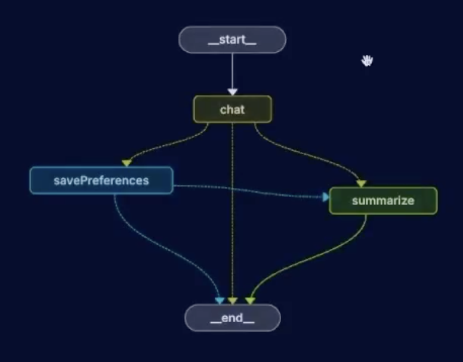

# Song Recommender with LangGraph Memory

This project is a conversational music recommender built with LangGraph and structured LLM responses. The main idea is simple: the assistant keeps track of the user context over time, extracts user preferences from the conversation, persists them, and uses them to make better song recommendations without losing the thread of the dialogue.

The project is intentionally small and explicit: each graph node has a clear responsibility, and the flow is designed to be easy to remember and explain.



## Main goal

The system is not just a "chatbot" that answers a single message. It is a stateful recommendation flow that:

- understands conversational context,
- extracts new user preferences from explicit statements,
- stores those preferences safely,
- summarizes long conversations to keep the context compact,
- recommends specific songs based on known tastes.

## Graph flow

The graph is defined in [src/graph/graph.ts](src/graph/graph.ts).

```text
START
 ↓
chat
 ↓
routeAfterChat
 ├─ if extractedPreferences exists → savePreferences
 ├─ else if needsSummarization → summarize
 └─ else → END

savePreferences
 ↓
routeAfterSavePreferences
 ├─ if needsSummarization → summarize
 └─ else → END

summarize
 ↓
END
```

### State and purpose

The graph state contains:

- `messages`: the message history used by LangGraph
- `userContext`: the remembered preference summary from the DB
- `extractedPreferences`: new structured info extracted from the current user message
- `needsSummarization`: signal that the conversation is long enough to compact
- `conversationSummary`: the compressed version of the conversation
- `userId`: user/session identifier

The state schema lives in [src/graph/graph.ts](src/graph/graph.ts) and is built with Zod, which makes the structure explicit and safe.

## Node-by-node flow

### 1) chat node

Implemented in [src/graph/nodes/chatNode.ts](src/graph/nodes/chatNode.ts).

This is the main orchestration step:

- loads the current `userContext` from the user profile summary if available,
- builds a prompt with:
 - a system prompt describing the assistant personality and extraction rules,
 - the current conversation history,
 - the actual latest user message,
- calls the LLM with a structured schema (`ChatResponseSchema`),
- receives a response shaped like:
 - `message`: the conversational answer to the user,
 - `preferences`: extracted new data from the user's statement,
 - `shouldSavePreferences`: boolean to decide whether to persist changes.

The key logic is:

```ts
const totalMessages = state.messages.length;
const needsSummarization = totalMessages >= config.maxMessagesToSummary;
```

This means the conversation can be compacted after the message count threshold is reached.

### 2) routeAfterChat

Defined in [src/graph/nodes/edgeConditions.ts](src/graph/nodes/edgeConditions.ts).

The decision rule is:

- if there are new extracted preferences: move to `savePreferences`
- else if summarization is needed: move to `summarize`
- otherwise end

This keeps the graph responsive and ensures preferences are stored before the conversation is summarized.

### 3) savePreferences node

Implemented in [src/graph/nodes/savePreferencesNode.ts](src/graph/nodes/savePreferencesNode.ts).

This node merges the extracted user preferences into the persistent profile:

- `preferencesService.mergePreferences(userId, state.extractedPreferences)`
- then clears the temporary extracted field so the state does not re-save on the next pass

This is the place where user-supplied facts become durable personal context.

### 4) summarize node

Implemented in [src/graph/nodes/summarizationNode.ts](src/graph/nodes/summarizationNode.ts).

When the conversation gets too long, the assistant creates a short summary of the relevant music preferences and context:

- it reads the whole conversation history,
- asks the model to consolidate it into a structured summary,
- stores that summary with the user,
- removes older messages from the working state,
- keeps the memory light but semantically useful.

This is the main strategy for avoiding prompt bloat while preserving continuity.

## Persistence architecture

### Memory service

The memory layer is created in [src/services/memoryService.ts](src/services/memoryService.ts).

It uses:

- `PostgresSaver` for LangGraph checkpointing / conversation state persistence
- `PostgresStore` for memory storage

This gives each user/thread isolation, while keeping the model state recoverable across runs.

### Preferences service

The user profile is persisted through [src/services/preferencesService.ts](src/services/preferencesService.ts), which uses SQLite via `better-sqlite3` and `knex`.

It stores structured information such as:

- name
- age
- favorite genres
- favorite bands/artists
- key preferences
- important context

The function `getBasicInfo(userId)` reconstructs a compact user summary to inject back into the prompt as `userContext`.

## Prompt design and extraction rules

The most important design pieces are in [src/prompts/v1/chatResponse.ts](src/prompts/v1/chatResponse.ts) and [src/prompts/v1/summarization.ts](src/prompts/v1/summarization.ts).

### Structured output

The chat node does not rely on free text alone. It expects a schema:

```ts
ChatResponseSchema = {
 message: string,
 preferences?: UserPreferences,
 shouldSavePreferences: boolean,
}
```

That schema ensures the model returns a consistent answer and explicit save/no-save decision.

### Important extraction rule

One of the core instructions from the project notes is very important:

- `shouldSavePreferences` must be `true` only when the user explicitly shares new personal information in the current message.
- The assistant must not treat recommendations it made as user preferences.
- Example: if the AI says "try Foo Fighters", that does not mean the user likes Foo Fighters.

This rule avoids a classic failure mode in memory agents: contaminated memory from AI-generated suggestions.

### Summary rule

The summary prompt is designed to:

- merge duplicates,
- keep explicit user preferences,
- preserve relevant context,
- avoid re-adding recommendations that were suggested by the assistant rather than declared by the user.

## Runtime flow from the CLI

The entry point is [src/index.ts](src/index.ts).

At runtime:

1. the graph is built through [src/graph/factory.ts](src/graph/factory.ts),
2. a user/thread ID is created,
3. existing memory is loaded from the store,
4. the conversation starts with a greeting message,
5. each new user input invokes the graph with the same thread config,
6. the assistant answers while remembering previous context.

The CLI can be started with:

```bash
npm run chat:igorRomero
```

or

```bash
npm run chat:ana
```

## Setup

1. Install dependencies:

```bash
npm install
```

2. Create a `.env` file with your OpenRouter credentials:

```env
OPENROUTER_API_KEY=your_key_here
```

3. Start the app:

```bash
npm run chat:igorRomero
```

4. Optional: run tests:

```bash
npm test
```

## Project notes / implementation memory

These are the key ideas to keep in mind when revisiting the project:

- The graph is a small but intentional workflow: `chat -> condition -> savePreferences/summarize -> end`.
- The assistant is rewarded for explicit user declarations, not for implicit inferences.
- The conversation summary is there to prevent prompt explosion.
- Memory should preserve personality and preferences, not the full transcript forever.
- The assistant is opinionated, warm, and recommendation-driven, but it must remain strict about what counts as a real user preference.

## Short mental model

If I had to describe this project in one sentence:

> It is a LangGraph recommendation agent that keeps a running user profile, updates it only from explicit user statements, and summarizes long histories so recommendations remain personalized without growing the prompt unbounded.


